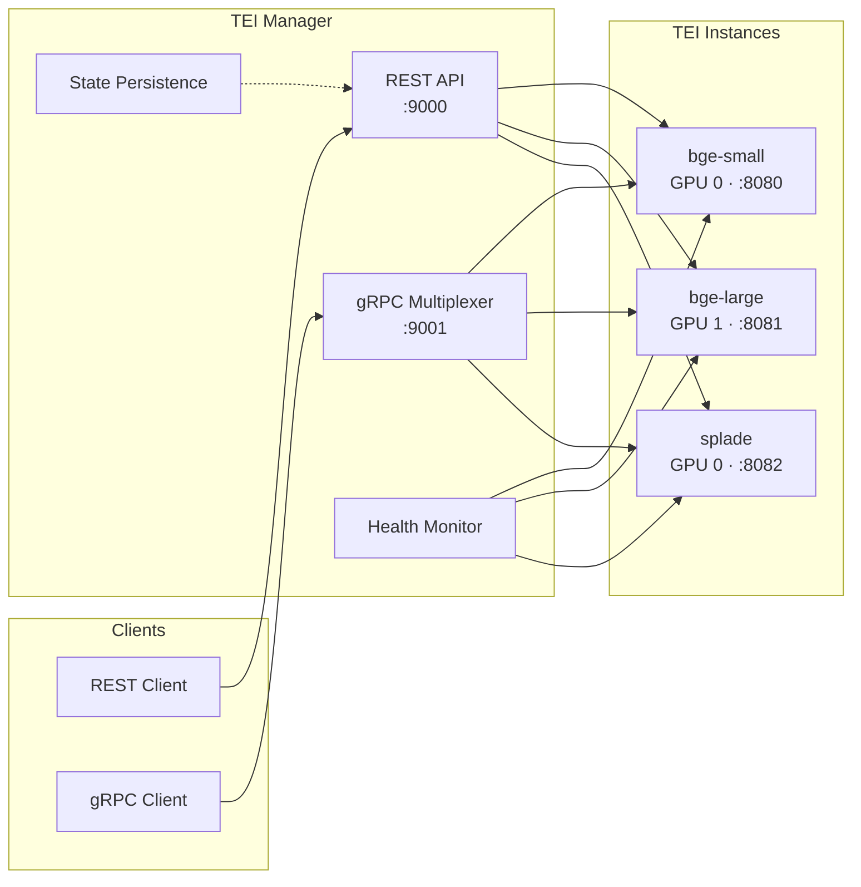

# TEI Manager

[](https://www.rust-lang.org/)
[](LICENSE)
[](https://codecov.io/gh/nazq/tei-manager)
[](Dockerfile)
[](https://github.com/huggingface/text-embeddings-inference)

Dynamic multi-instance manager for [HuggingFace Text Embeddings Inference](https://github.com/huggingface/text-embeddings-inference) (TEI). Run multiple embedding models simultaneously with intelligent resource management, health monitoring, and automatic recovery.

---

## Who Is This For?

TEI Manager is designed for teams running **multiple embedding models on a single GPU host** who want:

- **Unified API** - One gRPC endpoint to route requests to any model
- **Simple operations** - REST API for instance lifecycle, no orchestrator required
- **Production basics** - Health checks, auto-restart, metrics, state persistence

**Not a fit if you need:** Multi-node clustering, request queuing, per-tenant quotas, or Kubernetes-native autoscaling. For those, consider [Ray Serve](https://docs.ray.io/en/latest/serve/), [vLLM](https://vllm.ai), or [KServe](https://kserve.github.io/).

---

## Architecture


```mermaid
flowchart LR
    subgraph Clients
        C1[REST Client]
        C2[gRPC Client]
    end

    subgraph TEI Manager
        API[REST API<br/>:9000]
        MUX[gRPC Multiplexer<br/>:9001]
        HM[Health Monitor]
        ST[State Persistence]
    end

    subgraph TEI Instances
        T1[bge-small<br/>GPU 0 · :8080]
        T2[bge-large<br/>GPU 1 · :8081]
        T3[splade<br/>GPU 0 · :8082]
    end

    C1 --> API
    C2 --> MUX
    API --> T1 & T2 & T3
    MUX --> T1 & T2 & T3
    HM --> T1 & T2 & T3
    ST -.-> API
```

**Request flow:**
1. Clients send embedding requests to the gRPC Multiplexer (port 9001)
2. Multiplexer routes to the target instance based on `instance_name`
3. TEI instance processes the request on its assigned GPU
4. Response returns through the multiplexer to the client

**Management flow:**
- REST API (port 9000) handles instance lifecycle (create/start/stop/delete)
- Health Monitor checks each instance periodically, auto-restarts on failure
- State Persistence saves instance configs to disk for crash recovery

---

## Features

- **Dynamic Instance Management** - Create, start, stop, restart, and delete TEI instances via REST API
- **Model Registry** - Track, download, and verify HuggingFace models before deployment
- **Multi-GPU Support** - Pin instances to specific GPUs or share across all available GPUs
- **gRPC Multiplexer** - Unified streaming gRPC endpoint for routing requests to multiple instances
- **Arrow Batch Embeddings** - High-throughput batch embedding via Arrow IPC with per-row error reporting
- **Rust Benchmark Client** - Built-in gRPC client for benchmarking and integration examples
- **State Persistence** - Automatic state saving with atomic writes and crash recovery
- **Health Monitoring** - Continuous health checks with configurable auto-restart on failure
- **Prometheus Metrics** - Built-in metrics export for monitoring instance lifecycle and operations
- **mTLS Authentication** - Optional mutual TLS for secure gRPC connections

---

## Docker Images

TEI Manager images are built on the [TEI gRPC base images](https://github.com/huggingface/text-embeddings-inference?tab=readme-ov-file#docker-images), which provide GPU-optimized kernels for embedding inference.

**Tag format:** `{manager_version}-tei-{tei_version}[-{variant}]`

> See [latest releases](https://github.com/nazq/tei-manager/releases) for current image tags.

| Variant | Tag suffix | Base Image | Target |
|---------|-----------|------------|--------|
| Ampere | *(none)* | `text-embeddings-inference:{tei}-grpc` | Ampere sm_80 (A100, A30) — **not** a universal image |
| CPU | `-cpu` | `text-embeddings-inference:cpu-{tei}-grpc` | No GPU required |
| Ada | `-ada` | `text-embeddings-inference:89-{tei}-grpc` | RTX 40xx, L4, L40, L40S |
| Hopper | `-hopper` | `text-embeddings-inference:hopper-{tei}-grpc` | H100, H200 |
| Blackwell | `-blackwell` | `text-embeddings-inference:120-{tei}-grpc` | RTX 50xx (5090, 5080) |

---

## Quick Start

### Using Docker

```bash
# Pull the image for your GPU architecture (replace <version> from latest release)
docker pull ghcr.io/nazq/tei-manager:<version>        # Ampere sm_80 (A100, A30)
docker pull ghcr.io/nazq/tei-manager:<version>-cpu     # CPU-only (no GPU)
docker pull ghcr.io/nazq/tei-manager:<version>-ada     # Ada (RTX 40xx, L4, L40, L40S)
docker pull ghcr.io/nazq/tei-manager:<version>-hopper  # Hopper (H100, H200)
docker pull ghcr.io/nazq/tei-manager:<version>-blackwell  # Blackwell (RTX 5090, 5080)

# Run with GPU support
docker run -d --gpus all \
  --name tei-manager \
  -p 9000:9000 \
  -p 9001:9001 \
  -p 8080-8089:8080-8089 \
  ghcr.io/nazq/tei-manager:<version>
```

```bash
# Create an embedding instance
curl -X POST http://localhost:9000/instances \
  -H "Content-Type: application/json" \
  -d '{"name": "bge-small", "model_id": "BAAI/bge-small-en-v1.5"}'

# Wait for instance to be ready (~30s for model download)
curl http://localhost:9000/instances/bge-small

# Generate embeddings via REST (direct to TEI)
curl -X POST http://localhost:8080/embed \
  -H "Content-Type: application/json" \
  -d '{"inputs": "Hello world"}'
```

### Using gRPC with grpcurl

```bash
# Generate embeddings via gRPC multiplexer
grpcurl -plaintext -d '{
  "target": {"instance_name": "bge-small"},
  "request": {"inputs": "Hello world", "truncate": true, "normalize": true}
}' localhost:9001 tei_multiplexer.v1.TeiMultiplexer/Embed

# Get instance info
grpcurl -plaintext -d '{
  "target": {"instance_name": "bge-small"}
}' localhost:9001 tei_multiplexer.v1.TeiMultiplexer/Info

# List available services
grpcurl -plaintext localhost:9001 list
```

---

## gRPC API

The gRPC multiplexer provides a unified endpoint for routing embedding requests to any managed instance.

### Available Methods

| Method | Description |
|--------|-------------|
| `Embed` | Generate dense embeddings for a single text |
| `EmbedStream` | Streaming dense embeddings |
| `EmbedSparse` | Generate sparse embeddings (SPLADE) |
| `EmbedArrow` | **High-throughput batch dense embedding via Arrow IPC** |
| `EmbedSparseArrow` | **High-throughput batch sparse embedding via Arrow IPC** |
| `Rerank` | Rerank documents by relevance |
| `Tokenize` | Tokenize text |
| `Info` | Get model information |

### Arrow Batch Embeddings

The `EmbedArrow` and `EmbedSparseArrow` endpoints enable high-throughput batch processing using Apache Arrow IPC format:

```bash
# Dense embeddings via Arrow IPC
grpcurl -plaintext -d '{
  "target": {"instance_name": "bge-small"},
  "arrow_ipc": "<base64-encoded-arrow-ipc>",
  "truncate": true,
  "normalize": true
}' localhost:9001 tei_multiplexer.v1.TeiMultiplexer/EmbedArrow

# Sparse embeddings via Arrow IPC (SPLADE models)
grpcurl -plaintext -d '{
  "target": {"instance_name": "splade"},
  "arrow_ipc": "<base64-encoded-arrow-ipc>",
  "truncate": true
}' localhost:9001 tei_multiplexer.v1.TeiMultiplexer/EmbedSparseArrow
```

**Routing:** `target` takes `instance_name`, or `model_id` to route to any *running* instance serving that model — round-robin across matches, each RPC pinned wholly to one instance (a batch is never split). No running match → `NotFound` naming the model. On a multi-GPU box, create one instance per GPU with the same `model_id` and clients simply target the model.

**Request:** the first column of the first RecordBatch is the text (`Utf8`, `LargeUtf8` or `Utf8View`). Optional fields: `truncation_direction`, `prompt_name`, `dimensions` (dense only, Matryoshka truncation), `compression` for the *response* (`ARROW_COMPRESSION_NONE` default — vectors don't compress; `ARROW_COMPRESSION_LZ4` available) and `output_dtype` (`F32` default via server config, `F16` halves the payload).

**Response:** exactly one row per input row, in input order, with two columns:
- Dense: `embeddings` — `FixedSizeList<Float32|Float16>[dim]`, nullable; Sparse: `sparse_embeddings` — `List<Struct<index:u32, value:f32>>`, nullable
- `error` — `Utf8`, nullable. Set (and the vector null) for rows the backend rejected (empty input, too long without `truncate`, null text). Backend failures such as a dead instance fail the whole call instead.

**Benefits:**
- Process thousands of texts in a single request; keep 2–4 requests in flight per instance to keep the GPU queue full
- Skip-and-record per row: one bad document no longer fails the batch
- Dense: zero-copy access to a contiguous `Float32` buffer

---

## Rust Benchmark Client

TEI Manager includes a built-in Rust benchmark client for testing throughput and latency. This also serves as a complete example for integrating with the gRPC API from Rust.

### Installation

```bash
# Build from source
cargo build --release --bin bench-client

# Or run directly
cargo run --release --bin bench-client -- --help
```

### Usage

```bash
# Standard mode: concurrent single-text requests
bench-client -e http://localhost:9001 -i bge-small \
  --mode standard --num-texts 10000 --batch-size 100

# Arrow mode: batched Arrow IPC requests (recommended for throughput)
bench-client -e http://localhost:9001 -i bge-small \
  --mode arrow --num-texts 100000 --batch-size 1000

# With mTLS
bench-client -e https://localhost:9001 -i bge-small \
  --cert client.pem --key client-key.pem --ca ca.pem \
  --mode arrow --num-texts 100000 --batch-size 1000
```

### Example Output

```json
{
  "mode": "arrow",
  "instance_name": "bge-small",
  "num_texts": 100000,
  "batch_size": 1000,
  "num_requests": 100,
  "total_duration_secs": 12.34,
  "throughput_per_sec": 8103.72,
  "successful": 100000,
  "failed": 0
}
```

### Using as a Rust Library Example

The bench-client source (`src/bin/bench-client.rs`) demonstrates:
- Connecting to the gRPC multiplexer with/without TLS
- Creating Arrow IPC batches (LZ4-compressed on the text side)
- Sending `EmbedArrow` requests and parsing responses
- Concurrent request handling with Tokio

---

## REST API

### Endpoints

| Method | Endpoint | Description | Success | Error Codes |
|--------|----------|-------------|---------|-------------|
| `GET` | `/health` | Health check | 200 | - |
| `GET` | `/metrics` | Prometheus metrics | 200 | - |
| `GET` | `/instances` | List all instances | 200 | - |
| `GET` | `/instances/{name}` | Get instance details | 200 | 404 `INSTANCE_NOT_FOUND` |
| `POST` | `/instances` | Create new instance | 201 | 409 `INSTANCE_EXISTS`, 422 `PORT_CONFLICT` |
| `DELETE` | `/instances/{name}` | Delete instance | 200 | 404 `INSTANCE_NOT_FOUND` |
| `POST` | `/instances/{name}/start` | Start instance | 200 | 404, 409 `ALREADY_RUNNING` |
| `POST` | `/instances/{name}/stop` | Stop instance | 200 | 404, 409 `NOT_RUNNING` |
| `POST` | `/instances/{name}/restart` | Restart instance | 200 | 404 |
| `GET` | `/instances/{name}/logs` | Get instance logs | 200 | 404 |
| `GET` | `/models` | List all known models | 200 | - |
| `POST` | `/models` | Register a model | 201 | - |
| `GET` | `/models/{id}` | Get model details | 200 | 404 `MODEL_NOT_FOUND` |
| `POST` | `/models/{id}/download` | Download model to cache | 200 | 409 `MODEL_BUSY`, 500 |
| `POST` | `/models/{id}/load` | Smoke test model loading | 200 | 409 `MODEL_BUSY`, 500 |
| `POST` | `/state/reset` | Drop persisted state, reseed from config | 200 | 500 |

Error responses include a machine-readable `code` field:
```json
{"error": "Instance not found", "code": "INSTANCE_NOT_FOUND", "timestamp": "..."}
```

### Reset State

Persisted state takes precedence over the config file: `[[instances]]` entries
only seed instances whose names are missing from the state. When the state has
drifted and the config should win, `POST /state/reset` stops and removes every
instance, clears the persisted state file, and reseeds all `[[instances]]` from
the manager's config (deleting the state file by hand does not work — the
shutdown handler rewrites it). Responds with `{"stopped": n, "seeded": m}`.

### Create Instance

```bash
curl -X POST http://localhost:9000/instances \
  -H "Content-Type: application/json" \
  -d '{
    "name": "my-model",
    "model_id": "BAAI/bge-small-en-v1.5",
    "gpu_id": 0,
    "max_batch_tokens": 16384,
    "max_concurrent_requests": 512
  }'
```

**Required Fields:**
- `name` - Unique instance name
- `model_id` - HuggingFace model ID

**Optional Fields:**
- `port` - HTTP port (auto-assigned if omitted)
- `gpu_id` - GPU to pin instance to (omit to use all GPUs)
- `max_batch_tokens` - Max tokens per batch (default: 16384)
- `max_concurrent_requests` - Max concurrent requests (default: 512)
- `pooling` - Pooling method (e.g., "splade" for sparse models)

### Model Registry

The model registry tracks HuggingFace models and their status. Models are auto-discovered from the HF cache on startup.

```bash
# List all known models
curl http://localhost:9000/models

# Register a model (checks if already cached)
curl -X POST http://localhost:9000/models \
  -H "Content-Type: application/json" \
  -d '{"model_id": "BAAI/bge-small-en-v1.5"}'

# Download a model to cache
curl -X POST "http://localhost:9000/models/BAAI%2Fbge-small-en-v1.5/download"

# Smoke test model loading (loads on GPU 0, verifies, unloads)
curl -X POST "http://localhost:9000/models/BAAI%2Fbge-small-en-v1.5/load"

# Get model details (cache path, size, metadata, verification status)
curl "http://localhost:9000/models/BAAI%2Fbge-small-en-v1.5"
```

**Model Status Flow:**
- `available` - Model is registered but not downloaded
- `downloading` - Download in progress
- `downloaded` - Model is in HF cache
- `loading` - Smoke test in progress
- `verified` - Smoke test passed, ready to use
- `failed` - Smoke test failed (check `verification_error`)

> **Note:** Model IDs contain `/` which must be URL-encoded as `%2F` in paths.

---

## Configuration

### Environment Variables

```bash
TEI_MANAGER_API_PORT=9000           # REST API port
TEI_MANAGER_GRPC_PORT=9001          # gRPC multiplexer port
TEI_MANAGER_STATE_FILE=/data/state.toml
TEI_BINARY_PATH=/usr/local/bin/text-embeddings-router
```

### Config File

```toml
api_port = 9000
grpc_port = 9001
state_file = "/data/state.toml"
health_check_interval_secs = 30
max_instances = 10

# Pre-register models (checked against HF cache on startup)
models = [
  "BAAI/bge-small-en-v1.5",
  "sentence-transformers/all-MiniLM-L6-v2"
]

# Seed instances (auto-started on boot)
[[instances]]
name = "bge-small"
model_id = "BAAI/bge-small-en-v1.5"
gpu_id = 0
max_batch_tokens = 0            # 0 / "auto" via the API: derived from free VRAM

# Rented / unknown hardware
gpu_preflight = "warn"          # "fail" to refuse to start on a mismatched GPU image
auto_max_batch_tokens_per_gib = 2048
arrow_output_dtype = "f32"      # or "f16" to halve EmbedArrow payloads by default
```

### Tracing (OpenTelemetry)

tei-manager honours W3C `traceparent`/`tracestate` on inbound gRPC metadata and HTTP headers, so its spans appear as children of the caller's trace, and forwards the context to text-embeddings-router (which joins the trace if started with `--otlp-endpoint` via `extra_args`). Spans follow OTel RPC semantic conventions (`rpc.system`, `rpc.service`, `rpc.method`) plus `tei.instance`, `tei.rows`, `tei.rows_failed`, `tei.output_dtype`; each backend stream is a `tei.embed_stream` child with `tei.batches` / `tei.errors`. JSON log lines inside a request carry `trace_id` / `span_id` in their span context.

```toml
[otel]
endpoint = "http://otel-collector:4317"   # OTLP/gRPC; empty = no export (propagation still on)
service_name = "tei-manager"
sample_ratio = 1.0
deployment_environment = "dev"
```

`TEI_MANAGER_OTEL_ENDPOINT` overrides `endpoint`.

### Running on rented GPUs (vast.ai, RunPod)

- Pick the image for the card (see [Docker Images](#docker-images)). On start, tei-manager compares every visible GPU's compute capability with the TEI build in the image and logs a mismatch with the tag to use instead (`gpu_preflight = "fail"` turns that into a hard stop).
- The same preflight compares the host driver's supported CUDA version (from the `nvidia-smi` banner) with the CUDA userspace the image requires (`NVIDIA_REQUIRE_CUDA`). Rental hosts often run older drivers: e.g. driver 570 supports CUDA 12.8, and under a CUDA 12.9 image TEI gets `CUDA_ERROR_COMPAT_NOT_SUPPORTED_ON_DEVICE` and silently serves embeddings on CPU, ~50x slower, behind green health. As a second line of defense, when an instance first reports healthy its TEI log is scanned for `Using CPU instead`: with `gpu_fallback = "fail"` (default) the instance is marked `failed` with the log line as the reason; `"warn"` keeps it running and surfaces the line in the instance's `last_error`; `"off"` disables the check.
- Create instances with `"max_batch_tokens": "auto"` — the value is derived from the free VRAM of the target GPU at creation time and reported back in the instance JSON.
- For batch export over the network, request `output_dtype: OUTPUT_DTYPE_F16` on `EmbedArrow` (or set `arrow_output_dtype = "f16"`) to halve egress; f16 is lossy, so validate retrieval on your own data first.

---

## Examples

### Multi-GPU Setup

```bash
# GPU 0: Small model for low-latency
curl -X POST http://localhost:9000/instances \
  -H "Content-Type: application/json" \
  -d '{"name": "fast", "model_id": "BAAI/bge-small-en-v1.5", "gpu_id": 0}'

# GPU 1: Large model for quality
curl -X POST http://localhost:9000/instances \
  -H "Content-Type: application/json" \
  -d '{"name": "quality", "model_id": "BAAI/bge-large-en-v1.5", "gpu_id": 1}'

# Route requests to either via gRPC
grpcurl -plaintext -d '{"target": {"instance_name": "fast"}, "request": {"inputs": "Quick query"}}' \
  localhost:9001 tei_multiplexer.v1.TeiMultiplexer/Embed

grpcurl -plaintext -d '{"target": {"instance_name": "quality"}, "request": {"inputs": "Important document"}}' \
  localhost:9001 tei_multiplexer.v1.TeiMultiplexer/Embed
```

### Sparse Embeddings (SPLADE)

```bash
curl -X POST http://localhost:9000/instances \
  -H "Content-Type: application/json" \
  -d '{
    "name": "splade",
    "model_id": "naver/splade-cocondenser-ensembledistil",
    "pooling": "splade"
  }'

# Generate sparse embeddings
grpcurl -plaintext -d '{
  "target": {"instance_name": "splade"},
  "request": {"inputs": "Information retrieval"}
}' localhost:9001 tei_multiplexer.v1.TeiMultiplexer/EmbedSparse
```

---

## Development

```bash
# Install just: cargo install just
just --list              # Show all available commands

# Common workflows
just test                # Run unit tests
just check               # Format check + clippy + all tests
just coverage            # Generate HTML coverage report
just docker-build        # Build Docker image
just pre-commit          # Run before committing
```

---

## Documentation

- **[DESIGN.md](DESIGN.md)** - Architecture and design decisions
- **[docs/GRPC_MULTIPLEXER.md](docs/GRPC_MULTIPLEXER.md)** - Full gRPC API reference
- **[docs/DEPLOYMENT.md](docs/DEPLOYMENT.md)** - Production deployment guide
- **[docs/MTLS.md](docs/MTLS.md)** - mTLS configuration

---

## Known Limitations

- **Single host only** - No clustering or multi-node coordination
- **No request queuing** - Requests exceeding TEI's `max_concurrent_requests` return errors immediately
- **No per-tenant auth** - mTLS authenticates connections, not individual requests
- **Port range required** - Each instance needs an HTTP port; plan your port range accordingly

### Future Directions

- Model-based routing (route by `model_id` instead of `instance_name`)
- HTTP embedding endpoint on manager (avoid direct TEI access)
- Metrics-based instance recommendations

---

## Versioning

TEI Manager follows [Semantic Versioning](https://semver.org/):

- **MAJOR** - Breaking changes to REST/gRPC APIs or config format
- **MINOR** - New features, backward-compatible
- **PATCH** - Bug fixes only

**Docker tag format:** `{manager_version}-tei-{tei_version}[-{arch}]`

The manager version tracks our API stability. The TEI version tracks the embedded TEI binary. We test against TEI's gRPC interface and will bump MINOR if TEI changes require manager updates.

**Current stability:**
- REST API: Stable since v0.4.0
- gRPC API: Stable since v0.3.0
- Config format: Stable since v0.1.0

---

## License

Apache License 2.0 - see [LICENSE](LICENSE) for details.
